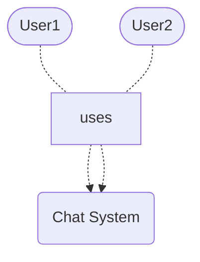

# SChat
SChat is an application that provides a no-setup, spontaneous and anonymous chatting experience that is fully encrypted and leaves no trails.

## Description

SChat uses a websocket server that acts as a relay between clients. 

On initial connection, users receive a uniquely generated private key that is used in order to encrypt and decrypt messages sent between parties. The server acts only as a message passing relay and does not keep any records of the messages transmitted or the keys to decrpyt them.

All messages sent or received are kept strictly client-side in memory, and are not recorded in any type of local storage. Once you close the window, all messages are lost.

## Usage

In order to start an anonymous conversation, both chatters navigate to a common url that serves as a ChatId on the hosting domain.

If no specific chatId is chosen, the application generates a unique id that can be shared between parties.

## Installation

If you wish to host the application, clone the repository and run 
```bash
cd WS-Server
docker-compose up
```
in the project root to build the back-end.

For the front-end run
```bash
cd WS-Client/SChat
npm i
npm start
```
## Structure

### System Context Diagram



### Container Diagram


### Component Diagram


### Code Diagram


## License
[MIT](https://choosealicense.com/licenses/mit/)